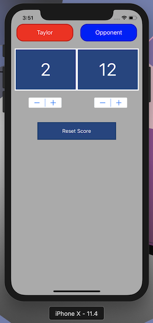
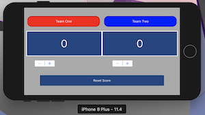

  

  <h3 align="center">Ping Pong Scorekeeper</h3>

  

    App created for the iPhone in order to keep track of score for a game of ping pong.
    Supports both veritcal and landscape modes.
  

## Creator

## View Project
 

## Status

